layout: true
  

`r paste0("
", params$event, " 

")` 

---

class: center, middle

Ces slides en ligne : `r paste0("http://datactivist.coop/", params$slug)`

Sources : `r paste0("https://github.com/datactivist/", params$slug)`

Les productions de Datactivist sont librement réutilisables selon les termes de la licence [Creative Commons 4.0 BY-SA](https://creativecommons.org/licenses/by-sa/4.0/legalcode.fr).

 
 

---

### We .red[open data], we make them .red[useful]

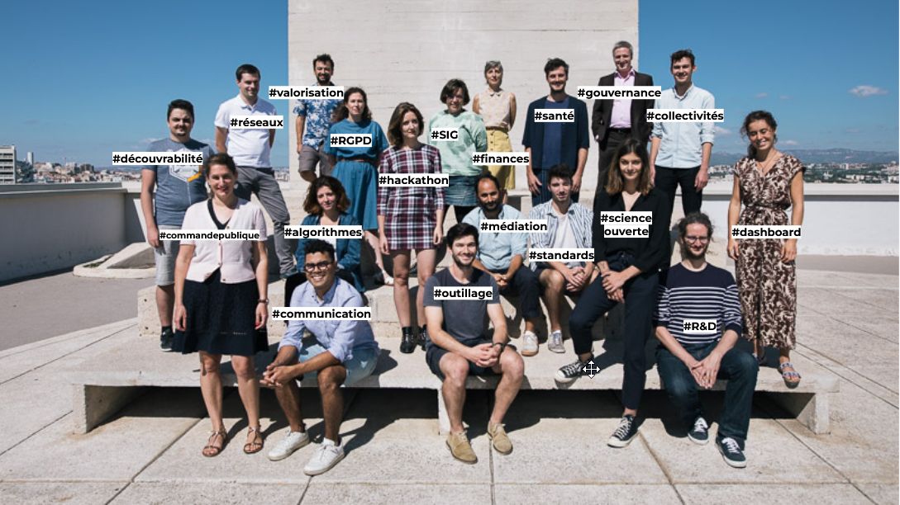

---

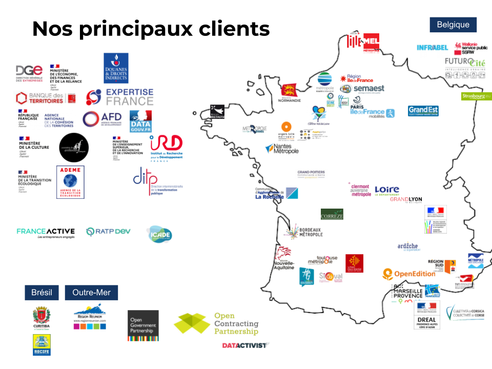

---

class: inverse, center, middle

# 1. Yuka

.center[]

---

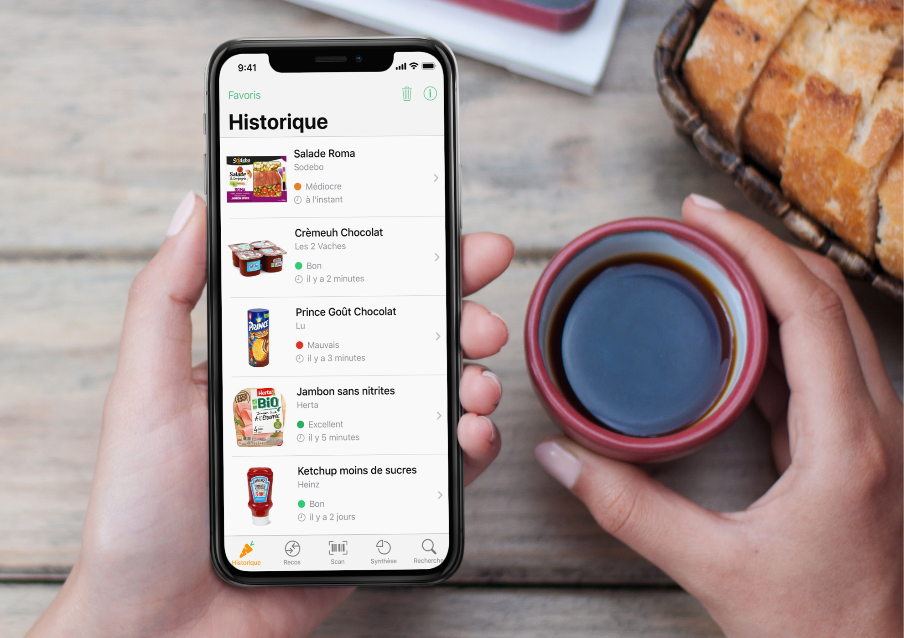

---
## Yuka 

### 25 millions d'utilisateurs
### 35 scans de produits par seconde
### Top 50 des applis gratuites sur l'Appstore et le Playstore
### 2 million € de CA en [2022](https://www.pappers.fr/entreprise/yuca-817769466)

???

Trois sources de revenus (wikipedia) : 
- fremium (70%). exemple accès hors ligne
- vente calendrier produit de saison (20%)
- vente d'un programme nutrition (10%)

En 2017, Yuka s'appuyait exclusivement sur Open Food Facts
À partir de janvier 2018, une base de données propriétaire est mise en place pour ajouter un système de contrôle et de vérification des contributions

La base de données de Yuka continue à être alimentée par les contributions des utilisateurs à travers l’application. De plus, les industriels partagent aussi les informations de leurs produits14, grâce à la plate-forme Alkemics

Reste premier contributeur d'OFF

---

[.center[]](https://fr.openfoodfacts.org/decouvrir)

???

Derrière OFF, une association commun numérique, gouvernance partagée, données en ODBL

[.center[]](https://fr.openfoodfacts.org/decouvrir)

---
class: inverse, center, middle

# 2. Startups d'État

---

## beta.gouv.fr

.reduite[.center[[![beta.gouv.fr(./img/betagouv.png)]]](https://beta.gouv.fr/)

???

Créer des services numérique au plus près des besoins des usagers. Approche : mesure d'impact tous les 6 mois, amélioration continue, équipes autonomes

Base d'adresse Nationale, Pass Culture, SignalConso, Thcap, SignauxFaibles

---

## Au commencement était data.gouv.fr

.center[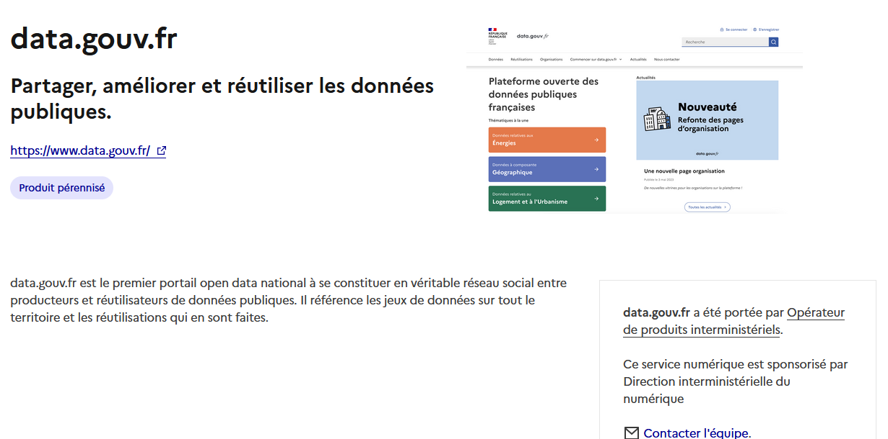]

???

La première Startup d’État est créée à titre expérimentale au sein de la DINSIC en 2013
pour la refonte du portail data.gouv.fr.

AU premier janvier 2024 : 
- 36 investigations en cours
- 213 services en accompagnement ou pérénisés
- 24 service numérique à impact national
- 17 incubateurs : diffusion dans les ministères

---
class: inverse, center, middle

# 3. Pokemon go 

.center[]

---

[.center[]](https://teamopendata.org/t/pokemon-go-migre-sur-openstreetmap/113)

???

C'est encore la cas en 2023, annonce officielle en 2022. 

https://openstreetmap.us/events/mapping-usa/2022/openstreetmap-and-pokemon-go-players/

---

## Google Maps

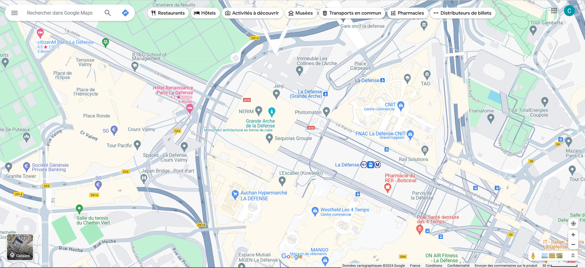

---
## OpenStreetMap

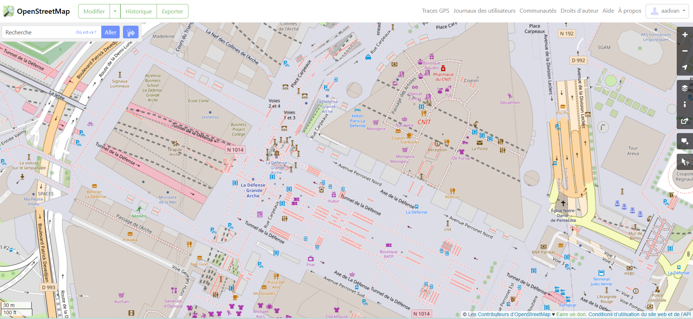

---
## OpenStreetMap

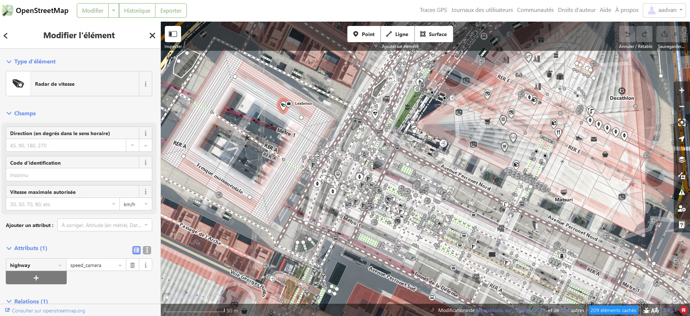

---
class: inverse, center, middle

# 4. Une carte de la pollution de l'air dans les écoles

---

## Merci Atmo Sud !

[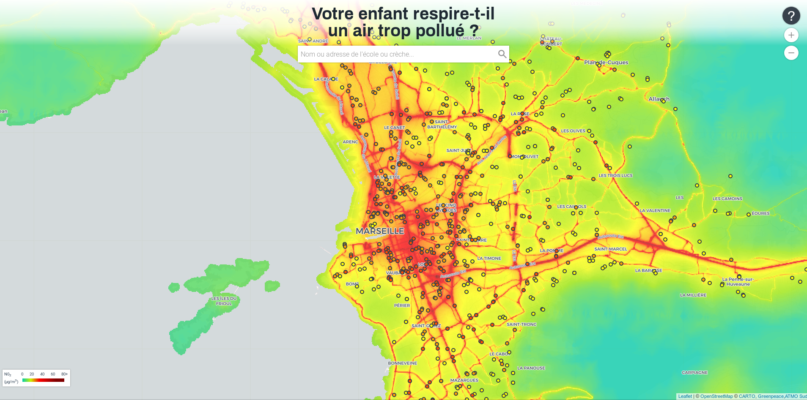](https://www.greenpeace.fr/pollution-ecole/marseille/)

---

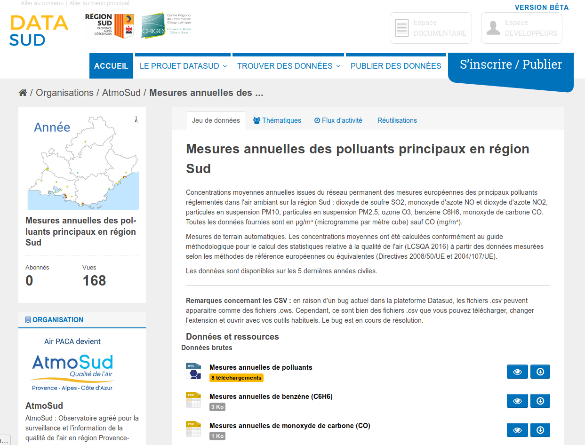

---
class: inverse, center, middle

# 5. Les applis de mobilité

---
## Les applis de mobilité

.center[.reduite[]]

---
## Les applis de mobilité

.center[.reduite[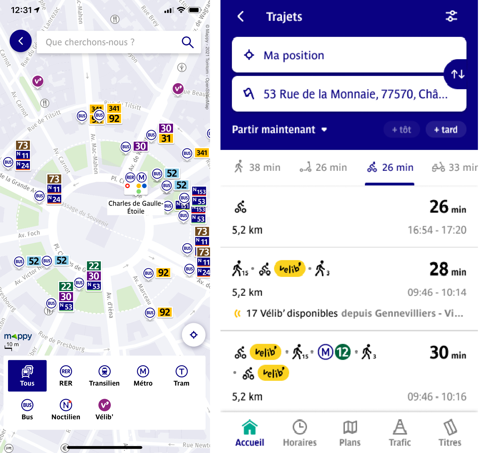]]

---

## Les applis de mobilité

.center[.reduite[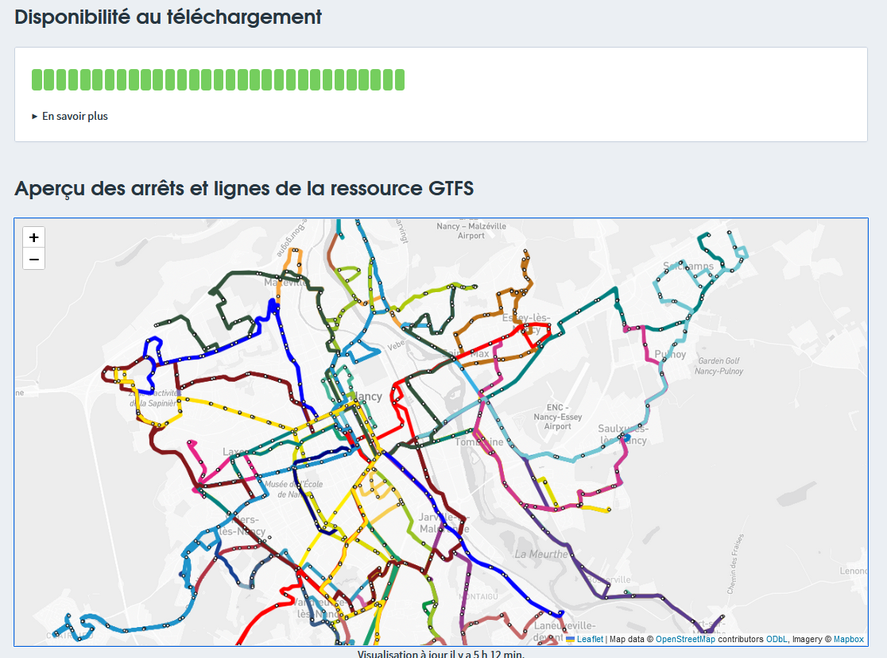]]

---
class: inverse, center, middle

# 6. Les demandes de valeurs foncières

---

[.center[]](https://www.meilleursagents.com/prix-immobilier/dvf/)

---
## Une réutilisation rendue possible par l'ouverture de données publiques

[.center[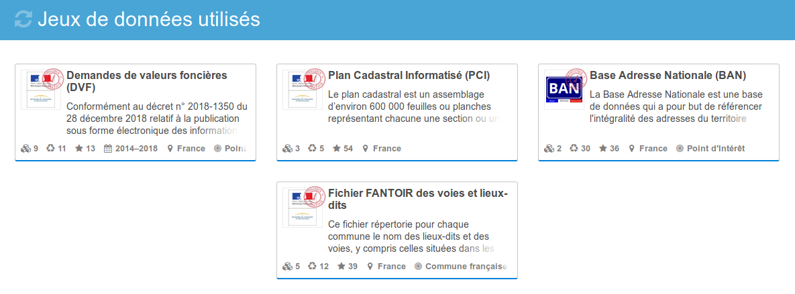]](https://www.data.gouv.fr/fr/reuses/explorateur-de-biens-vendus/)

---
class: inverse, center, middle

# 7. La polémique sur les 80 km/h

---

> On peut aussi citer la contre-expertise effectuée par l’association 40 millions d’automobilistes sur l’expérimentation d’abaissement de la limitation de vitesse à 80 km/h sur trois tronçons de routes secondaires en France. L’association s’est appuyée sur les données d’accidentologie publiées sur data.gouv.fr par le Ministère de l’Intérieur dans la base Bulletin d’analyse des accidents corporels de la circulation (BAAC). À partir de ces données, elle a comparé l’accidentalité relevé pour la période de l’expérimentation pour laquelle on dispose de données aux années précédentes pour déterminer l’impact de la mesure d’abaissement sur l’accidentalité et la mortalité des tronçons routiers concernés. La contre-expertise a montré que «  la limitation de vitesse n’a en rien permis de réduire la mortalité routière sur ces axes : 2 accidents mortels sont à déplorer sur les 86 kilomètres de l’expérimentation en 2016, soit 5 fois plus que la moyenne nationale qui s’élevait la même année à 0,4 tué pour 86 km de routes. » Ces chiffres ont été repris par la presse pour remettre en cause le rapport qui a fondé une partie de l’argumentaire du gouvernement en faveur de la généralisation de la mesure de la limitation de vitesse.

Source : livre à paraître de Samuel Goëta

---
class: inverse, center, middle

# 8. Mapillary

---
## Mapillary

[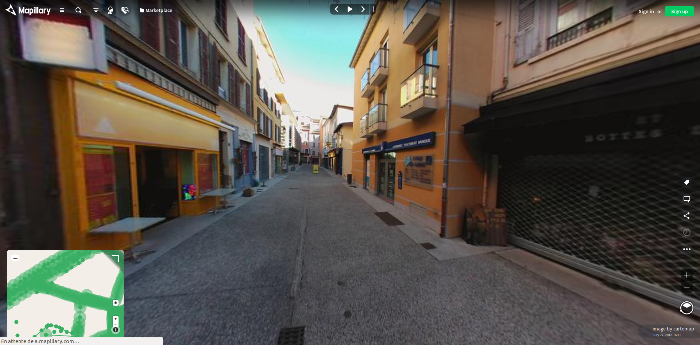](https://www.mapillary.com/map/im/AB9hac4KYucSZOaWQyunvw)

http://www.villes-internet.net/actions/5bbf52afbb3eab784351e5c5

---
## Mapillary

[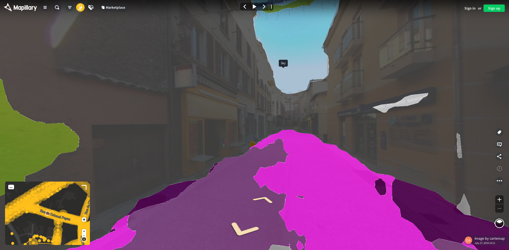](https://www.mapillary.com/map/im/AB9hac4KYucSZOaWQyunvw)

---
class: inverse, center, middle

# 9. Une canne blanche connectée

---
## Une canne blanche connectée

[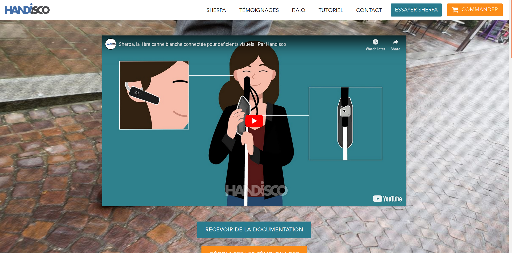](https://handisco.com/)

---
class: inverse, center, middle

# 10. Et pour finir... des cocktails !

---
## Des recettes de cocktails 

<iframe style="width: 80vw; height: 50vh; border: none;" src="https://query.wikidata.org/embed.html#%23defaultView%3AImageGrid%0ASELECT%20%3Fcocktail%20%3FcocktailLabel%20(SAMPLE(%3Frecipe)%20AS%20%3Frecipe)%20(SAMPLE(%3Fimage)%20AS%20%3Fimage)%0AWHERE%0A%7B%0A%20%20%7B%0A%20%20%20%20SELECT%20%3Fcocktail%20%3FcocktailLabel%20(GROUP_CONCAT(DISTINCT%20%3Fingredient%3B%20separator%3D%22%2C%20%22)%20AS%20%3FingredientsList)%20(GROUP_CONCAT(DISTINCT%20%3FgarnishLabel%3B%20separator%3D%22%2C%20%22)%20AS%20%3FgarnishList)%20(COUNT(DISTINCT%20%3Fingredient)%20%2B%20COUNT(DISTINCT%20%3FgarnishLabel)%20AS%20%3Fcount)%0A%20%20%20%20WHERE%0A%20%20%20%20%7B%0A%20%20%20%20%20%20%3Fcocktail%20wdt%3AP31%2Fwdt%3AP279*%20wd%3AQ134768%3B%0A%20%20%20%20%20%20%20%20%20%20%20%20%20%20%20%20p%3AP186%20%3FmaterialStat.%0A%20%20%20%20%20%20MINUS%20%7B%20%3FmaterialStat%20pq%3AP518%2Fwdt%3AP279*%20wd%3AQ2453629.%20%7D%0A%20%20%20%20%20%20MINUS%20%7B%20%3FmaterialStat%20ps%3AP186%20wd%3AQ488463%3B%20pq%3AP366%20wd%3AQ26876981.%20%7D%0A%20%20%20%20%20%20MINUS%20%7B%20%3FmaterialStat%20pq%3AP366%20wd%3AQ59541.%20%7D%0A%20%20%20%20%20%20%3FmaterialStat%20ps%3AP186%2Frdfs%3Alabel%20%3FmaterialLabel.%0A%20%20%20%20%20%20FILTER(LANG(%3FmaterialLabel)%20%3D%20%22en%22).%0A%20%20%20%20%20%20BIND(%3FmaterialLabel%20AS%20%3FingredientSolo).%0A%20%20%20%20%20%20OPTIONAL%20%7B%0A%20%20%20%20%20%20%20%20%3FmaterialStat%20ps%3AP186%2Frdfs%3Alabel%20%3FmaterialLabel%3B%0A%20%20%20%20%20%20%20%20%20%20%20%20%20%20%20%20%20%20%20%20%20%20pq%3AP1114%20%3Fquantity.%0A%20%20%20%20%20%20%20%20FILTER(LANG(%3FmaterialLabel)%20%3D%20%22en%22).%0A%20%20%20%20%20%20%20%20BIND(CONCAT(STR(%3Fquantity)%2C%20%22%20%22%2C%20%3FmaterialLabel)%20AS%20%3FingredientWithQuantity).%0A%20%20%20%20%20%20%20%20OPTIONAL%20%7B%0A%20%20%20%20%20%20%20%20%20%20%3FmaterialStat%20pq%3AP1114%20%3Fquantity%3B%0A%20%20%20%20%20%20%20%20%20%20%20%20%20%20%20%20%20%20%20%20%20%20%20%20ps%3AP186%2Frdfs%3Alabel%20%3FmaterialLabel%3B%0A%20%20%20%20%20%20%20%20%20%20%20%20%20%20%20%20%20%20%20%20%20%20%20%20pqv%3AP1114%2Fwikibase%3AquantityUnit%20%3Funit.%0A%20%20%20%20%20%20%20%20%20%20FILTER(LANG(%3FmaterialLabel)%20%3D%20%22en%22).%0A%20%20%20%20%20%20%20%20%20%20FILTER(%3Funit%20!%3D%20wd%3AQ199).%0A%20%20%20%20%20%20%20%20%20%20%3Funit%20rdfs%3Alabel%20%3FunitLabel.%0A%20%20%20%20%20%20%20%20%20%20FILTER(LANG(%3FunitLabel)%20%3D%20%22en%22).%0A%20%20%20%20%20%20%20%20%20%20BIND(CONCAT(STR(%3Fquantity)%2C%20%22%20%22%2C%20IF(%3Fquantity%20%3D%201%2C%20%3FunitLabel%2C%20CONCAT(%3FunitLabel%2C%20IF(STRENDS(%3FunitLabel%2C%20%22sh%22)%2C%20%22es%22%2C%20%22s%22)))%2C%20%22%20%22%2C%20%3FmaterialLabel)%20AS%20%3FingredientWithUnit).%0A%20%20%20%20%20%20%20%20%7D%0A%20%20%20%20%20%20%7D%0A%20%20%20%20%20%20BIND(COALESCE(%3FingredientWithUnit%2C%20%3FingredientWithQuantity%2C%20%3FingredientSolo)%20AS%20%3Fingredient).%0A%20%20%20%20%20%20OPTIONAL%20%7B%0A%20%20%20%20%20%20%20%20%3Fcocktail%20p%3AP186%20%5B%20ps%3AP186%20%3Fgarnish%3B%20pq%3AP366%20wd%3AQ59541%20%5D.%0A%20%20%20%20%20%20%20%20%3Fgarnish%20rdfs%3Alabel%20%3FgarnishLabel.%0A%20%20%20%20%20%20%20%20FILTER(LANG(%3FgarnishLabel)%20%3D%20%22en%22).%0A%20%20%20%20%20%20%7D%0A%20%20%20%20%20%20%3Fcocktail%20rdfs%3Alabel%20%3FcocktailLabel.%0A%20%20%20%20%20%20FILTER(LANG(%3FcocktailLabel)%20%3D%20%22en%22).%0A%20%20%20%20%7D%0A%20%20%20%20GROUP%20BY%20%3Fcocktail%20%3FcocktailLabel%0A%20%20%7D%0A%20%20BIND(%0A%20%20%20%20IF(REGEX(%3FingredientsList%2C%20%22%2C%20.*%2C%22)%2C%0A%20%20%20%20%20%20%20REPLACE(%3FingredientsList%2C%20%22(.*)%2C%20(.*)%22%2C%20%22%241%2C%20and%20%242%22)%2C%0A%20%20%20%20%20%20%20REPLACE(%3FingredientsList%2C%20%22(.*)%2C%20(.*)%22%2C%20%22%241%20and%20%242%22))%0A%20%20%20%20AS%20%3Fingredients).%0A%20%20BIND(%0A%20%20%20%20IF(REGEX(%3FgarnishList%2C%20%22%2C%20.*%2C%22)%2C%0A%20%20%20%20%20%20%20REPLACE(%3FgarnishList%2C%20%22(.*)%2C%20(.*)%22%2C%20%22%241%2C%20and%20%242%22)%2C%0A%20%20%20%20%20%20%20REPLACE(%3FgarnishList%2C%20%22(.*)%2C%20(.*)%22%2C%20%22%241%20and%20%242%22))%0A%20%20%20%20AS%20%3Fgarnishes).%0A%20%20OPTIONAL%20%7B%0A%20%20%20%20%3Fcocktail%20p%3AP186%20%5B%20ps%3AP186%20%3Fglass%3B%20pq%3AP518%2Fwdt%3AP279*%20wd%3AQ2453629%20%5D.%0A%20%20%20%20%3Fglass%20rdfs%3Alabel%20%3FglassLabel.%0A%20%20%20%20FILTER(LANG(%3FglassLabel)%20%3D%20%22en%22).%0A%20%20%20%20BIND(IF(REGEX(%3FglassLabel%2C%20%22%5E%5BAEIOUaeiou%5D%22)%2C%20%22an%22%2C%20%22a%22)%20AS%20%3Farticle).%0A%20%20%20%20BIND(CONCAT(%22%20in%20%22%2C%20%3Farticle%2C%20%22%20%22%2C%20%3FglassLabel)%20AS%20%3Fcontainer).%0A%20%20%20%20BIND(%22%2C%20served%22%20AS%20%3Fserved).%0A%20%20%7D%0A%20%20OPTIONAL%20%7B%0A%20%20%20%20%3Fcocktail%20p%3AP186%20%5B%20ps%3AP186%20wd%3AQ488463%3B%20pq%3AP366%20wd%3AQ26876981%20%5D.%0A%20%20%20%20BIND(%22%20on%20the%20rocks%22%20AS%20%3FonTheRocks).%0A%20%20%20%20BIND(%22%2C%20served%22%20AS%20%3Fserved).%0A%20%20%7D%0A%20%20OPTIONAL%20%7B%0A%20%20%20%20FILTER(STRLEN(STR(%3Fgarnishes))%20%3E%201).%0A%20%20%20%20BIND(CONCAT(%22%20with%20%22%2C%20%3Fgarnishes)%20AS%20%3Fgarnish).%0A%20%20%20%20BIND(%22%2C%20served%22%20AS%20%3Fserved).%0A%20%20%7D%0A%20%20BIND(CONCAT(%0A%20%20%20%20%3Fingredients%2C%0A%20%20%20%20COALESCE(%3Fserved%2C%20%22%22)%2C%0A%20%20%20%20COALESCE(%3FonTheRocks%2C%20%22%22)%2C%0A%20%20%20%20COALESCE(%3Fgarnish%2C%20%22%22)%2C%0A%20%20%20%20COALESCE(%3Fcontainer%2C%20%22%22))%0A%20%20%20%20AS%20%3Frecipe).%0A%20%20OPTIONAL%20%7B%20%3Fcocktail%20wdt%3AP18%20%3Fimage.%20%7D%0A%7D%0AGROUP%20BY%20%3Fcocktail%20%3FcocktailLabel%0AORDER%20BY%20DESC(MAX(%3Fcount))" referrerpolicy="origin" sandbox="allow-scripts allow-same-origin allow-popups"></iframe>

---
class: inverse, center, middle

# Merci !

Contact : [clement@datactivist.coop](mailto:clement@datactivist.coop)

