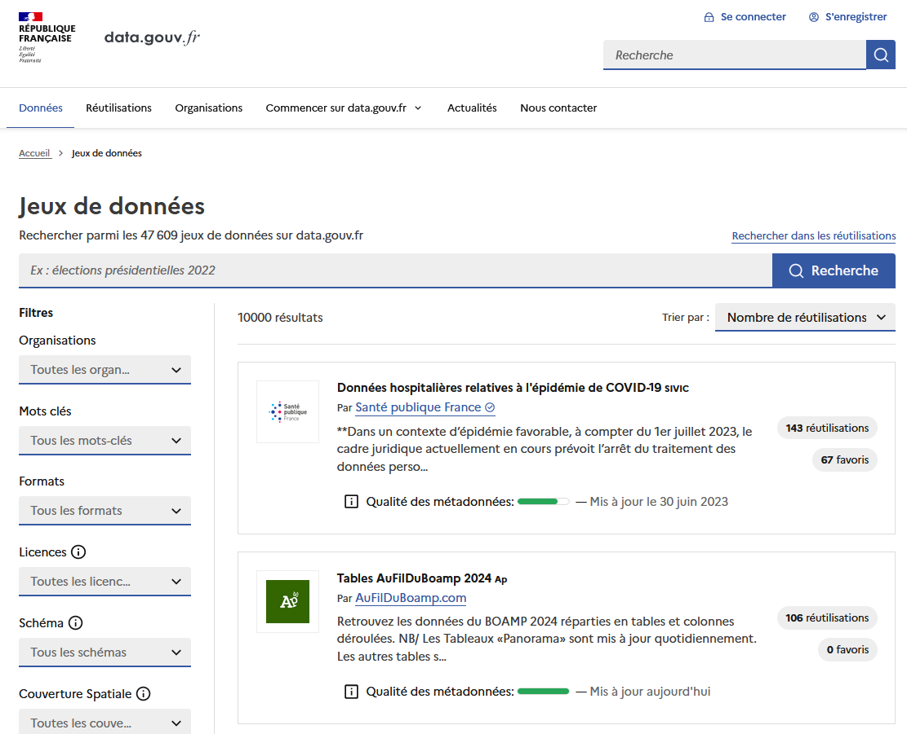
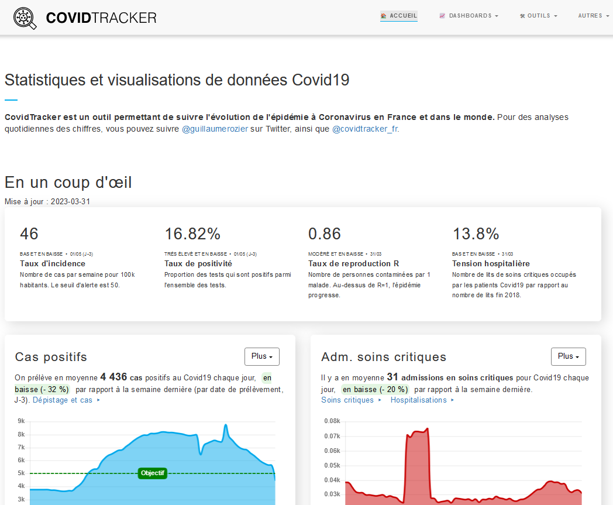

layout: true
  

`r paste0("
", params$event, " 

")` 

---

class: center, middle

Ces slides en ligne : `r paste0("http://datactivist.coop/", params$slug)`

Sources : `r paste0("https://github.com/datactivist/", params$slug)`

Les productions de Datactivist sont librement réutilisables selon les termes de la licence [Creative Commons 4.0 BY-SA](https://creativecommons.org/licenses/by-sa/4.0/legalcode.fr).

 
 

---

### We .red[open data], we make them .red[useful]

---
class: inverse, center, middle

# L'open data, c'est quoi ? 

---

## Open data : définition

Selon Wikipedia, une donnée ouverte c'est :
> une donnée numérique, d'origine publique ou privée, publiée de manière structurée selon une méthodologie qui garantit son libre accès et sa réutilisation par tous, sans restriction.
**L'ouverture des données est à la fois un mouvement, une philosophie d'accès à l'information et une pratique de publication de données** librement accessibles et exploitables.

---

## Des données ouvertes, pour être réutilisées

.pull-left[

]

.pull-right[
]

---
## .red[Les 8 principes] de l'open data

1/ **Des données complètes** : toutes les données publiques doivent être rendues disponibles dans les limites légales liées à la vie privée ou la sécurité.

2/ **Des données primaires** : les données ouvertes sont telles que collectées à la source, non-agrégées avec le plus haut niveau de granularité

3/ **Des données fraiches (*timely*)** : les données doivent être disponibles dès qu'elles sont produites

4/ **Des données accessibles** : les données doivent être utilisables par le plus grand nombre d’usagers potentiels

---

## .red[Les 8 principes] de l'open data

5/ **Des données exploitables par les machines** : Les données peuvent être traitées automatiquement par les machines

6/ **Des données non discriminatoires** : Elles peuvent être utilisées par tous sans réclamer un enregistrement préalable

7/ **Des données dans un format ouvert** : Ce format ne doit pas être la propriété d'une organisation en particulier (.xls) et doit être gouverné par ses usagers (exemple : CSV)

8/ **Des données dans une licence ouverte** : Idéalement dans le domaine public sinon dans une licence conforme à l'[Open Definition](https://opendefinition.org/od/2.1/en/) : Licence Ouverte (CC-BY) ou ODBL (CC-BY-SA)

---

### Loi pour une République Numérique : l'ouverture des données par défaut

.pull-left[
La [loi pour une République  Numérique](https://www.legifrance.gouv.fr/affichTexte.do;jsessionid=B5632993E54F7CCC2606664B64CDF612.tpdila11v_1?cidTexte=JORFTEXT000033202746&categorieLien=id) impose un principe d'.red[**ouverture des données par principe**] qui ne fait pas l'objet de sanctions à toutes les administrations, les entreprises délégataires d'une mission de service public et les .red[**collectivités locales de plus de 3500 habitants et 50 agents**]. 
]

.pull-right[

]

---
class: inverse, center, middle

# Trois choses qui n'existeraient pas sans l'open data

---

## 1. Yuka 

.pull-left[
- 25 millions d'utilisateurs
- 35 scans de produits par seconde
- Top 50 des applis gratuites sur l'Appstore et le Playstore
- 2 million € de CA en [2022](https://www.pappers.fr/entreprise/yuca-817769466)
]

.pull-right[

]

???

Trois sources de revenus (wikipedia) : 
- fremium (70%). exemple accès hors ligne
- vente calendrier produit de saison (20%)
- vente d'un programme nutrition (10%)

En 2017, Yuka s'appuyait exclusivement sur Open Food Facts
À partir de janvier 2018, une base de données propriétaire est mise en place pour ajouter un système de contrôle et de vérification des contributions

La base de données de Yuka continue à être alimentée par les contributions des utilisateurs à travers l’application. De plus, les industriels partagent aussi les informations de leurs produits14, grâce à la plate-forme Alkemics

Reste premier contributeur d'OFF

---

[.center[]](https://fr.openfoodfacts.org/decouvrir)

???

Derrière OFF, une association commun numérique, gouvernance partagée, données en ODBL

---
## 2. Les applis de mobilité

.center[.reduite[]]

---
## 2. Les applis de mobilité

.center[.reduite[]]

---
## 3. ChatGPT

???

Sans CommonCrawl = les données d'entrainement dans les mains d'un nombre réduit de personnes

ChatGPT et les autres LLM sont entraînés sur des données ouvertes. Par exemple Wikipedia. Mais aussi CommonCrawl

CommonCrawl : biais, souvent des versions mal-filtrées sont utilisées

Popular Common Crawl versions is often limited to removing pornography and relies on simple keyword lists or AI classifiers trained on user generated content that can itself be problematic

---
class: inverse, center, middle

# Merci !

Contact : [clement@datactivist.coop](mailto:clement@datactivist.coop)

