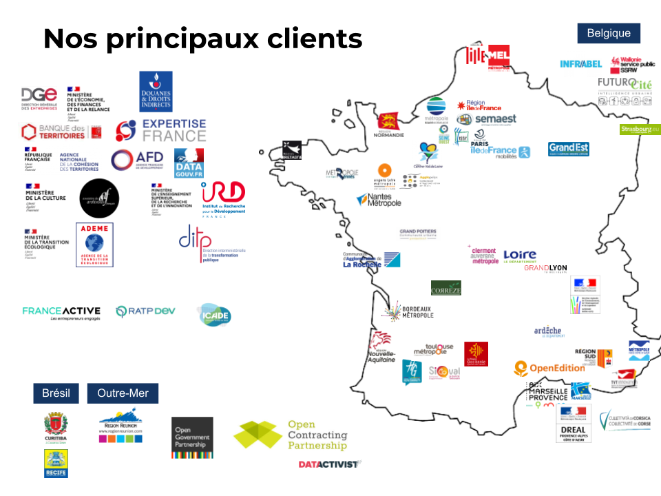
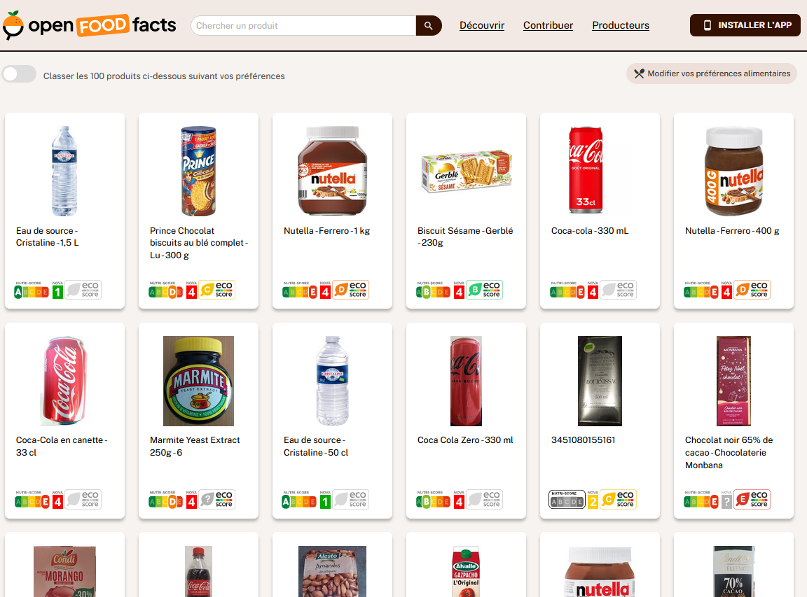
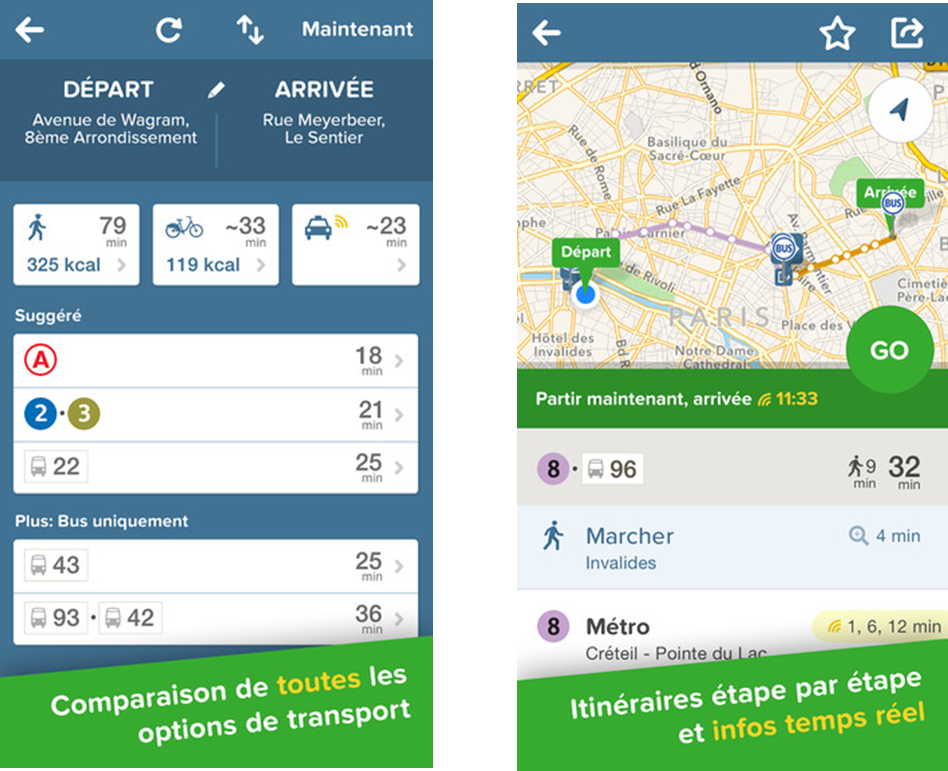

layout: true
  

`r paste0("
", params$event, " 

")` 

---

class: center, middle

Ces slides en ligne : `r paste0("http://datactivist.coop/", params$slug)`

Sources : `r paste0("https://github.com/datactivist/", params$slug)`

Les productions de Datactivist sont librement réutilisables selon les termes de la licence [Creative Commons 4.0 BY-SA](https://creativecommons.org/licenses/by-sa/4.0/legalcode.fr).

 
 

---
## Datactivist

---

---
class: inverse, center, middle

# Trois choses qui n'existeraient pas sans l'open data

---

## 1. Yuka 

.pull-left[
- 25 millions d'utilisateurs
- 35 scans de produits par seconde
- Top 50 des applis gratuites sur l'Appstore et le Playstore
- 2 million € de CA en [2022](https://www.pappers.fr/entreprise/yuca-817769466)
]

.pull-right[

]

???

Trois sources de revenus (wikipedia) : 
- fremium (70%). exemple accès hors ligne
- vente calendrier produit de saison (20%)
- vente d'un programme nutrition (10%)

En 2017, Yuka s'appuyait exclusivement sur Open Food Facts
À partir de janvier 2018, une base de données propriétaire est mise en place pour ajouter un système de contrôle et de vérification des contributions

La base de données de Yuka continue à être alimentée par les contributions des utilisateurs à travers l’application. De plus, les industriels partagent aussi les informations de leurs produits14, grâce à la plate-forme Alkemics

Reste premier contributeur d'OFF

---

[.center[]](https://fr.openfoodfacts.org/decouvrir)

???

Derrière OFF, une association commun numérique, gouvernance partagée, données en ODBL

---
## 2. Les applis de mobilité

.center[.reduite[]]

---
## 2. Les applis de mobilité

.center[.reduite[]]

---
## 3. ChatGPT

???

Sans CommonCrawl = les données d'entrainement dans les mains d'un nombre réduit de personnes

ChatGPT et les autres LLM sont entraînés sur des données ouvertes. Par exemple Wikipedia. Mais aussi CommonCrawl

CommonCrawl : biais, souvent des versions mal-filtrées sont utilisées

Popular Common Crawl versions is often limited to removing pornography and relies on simple keyword lists or AI classifiers trained on user generated content that can itself be problematic

---
class: inverse, center, middle

# Mon métier à travers deux exemples

---
## Obsevatoire des données de l'achat public

???

Idée : faire des entretiens avec les services pour voir qu'elle donnée est remplie comment ? 
Une fois cette observatoire en place, aller voir les filières. Co-construire des indicateurs avec l'observatoire

Aller sur le site, BILAN 1ER SCHÉMA 2018-2022 > source de données 

178 333,33 de drapeaux bretons en 2021

---
## MonDiagnosticArtificialisation

???

Parler des mêmes chiffres. 

Porter à connaissance

Rapports triennaux

Aller sur le site, CA melun val de sein, croisement avec document d'urbanisme. Quelles données utilisent MonDiagnosticArtificialisation ?

Expliquer un algorithme, c'est d'abord expliquer les données

---
## Travailler dans la "data" après STU ?

- Au délà de son aspect normatif (et performatif), la donnée est une opportunité pour des coalitions d'acteurs

- Développer votre culture générale de la donnée (savoirs, savoirs-faire, savoir-être)

- Vous êtes formé·e·s pour !

---

### Ce sera (peut-être) à vous de le faire

Des fonctions consacrées à la donnée encore relativement rares dans les administrations

.center[.reduite[]]

---

### Conférence-Débat Open data, pouvoirs et contre-pouvoirs 

.center[.reduite[]]

---
class: inverse, center, middle

# Merci !

Contact : [clement@datactivist.coop](mailto:clement@datactivist.coop)

